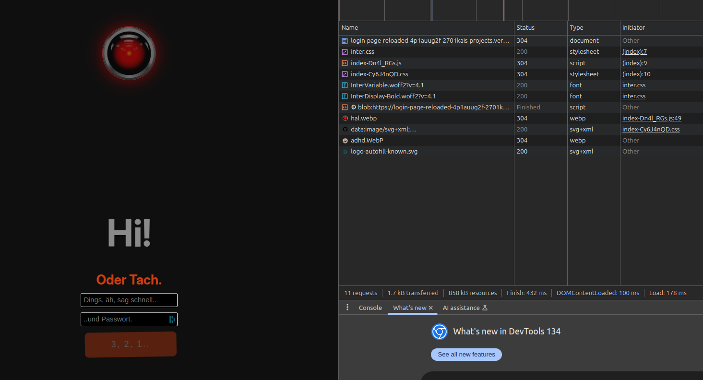
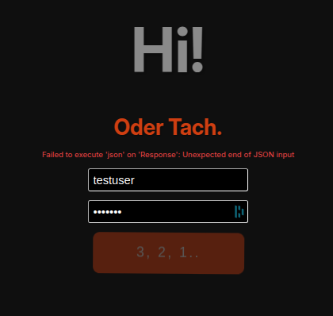

# Login-Page-Reloaded v.2.8.99: go full MERN 🤖

> history: see **[girl´s day rocks](https://github.com/2701kai/girl-s_day_rocks)** and **[login-page](https://github.com/2701kai/login-page)**

## 1st attempt on react..

### steps so far:

```bash
npm create vite@latest login-page
# template: react + vanilla.js
cd login-page/
npm i && npm run dev # works, so ctrl+c and
git init && git remote add origin https://github.com/2701kai/login-page.git
```

```bash
git push -u origin main # finally worked, :tada:
```

..nothing fancy yet.

---

## Router Installation + updating main.jsx

- input form created
- router installed: `npm i react-router-dom`

  > _what´s a router?_
  >
  > URLs mapped to components.
  > So `/login` can show `<Login />`, and `/dashboard` can show `<Dashboard />`.
  > React doesn’t have built-in routing, so we use `react-router-dom`.

- [main.jsx](./src/main.jsx) updated

---

## another humbling day..

leaving tailwind for now, I opted for uno.css.

```bash
npm install -D unocss
# @root:
touch uno.config.js #and edit with
```

```js
// uno.config.js
import { defineConfig, presetUno } from "unocss";

export default defineConfig({
  presets: [presetUno()],
});
```

then update `vite.config.js` respectively, adding UnoCSS as plugin:

```javascript
import { defineConfig } from "vite";
import react from "@vitejs/plugin-react";
import UnoCSS from "unocss/vite";

export default defineConfig({
  plugins: [react(), UnoCSS()],
});
```

> #### more: [UnoCSS](https://unocss.dev/integrations/vite)

---

## Update:

created reloaded version full MERN, then

```bash
gh repo create login-page-reloaded --public --source=. --remote=origin --push
```

years later.. n still annoying CSP

### fonts working:



### login still failing vercel / onrender:



### dev tools:

```json


fetch("https://login-page-reloaded.onrender.com/api/auth/login", {
  method: "POST",
  headers: { "Content-Type": "application/json" },
  body: JSON.stringify({ username: "testuser", password: "test123" }),
})
  .then((res) => {
    console.log("Status:", res.status);
    return res.text();
  })
  .then(console.log)
  .catch(console.error);
```

---

## Groundhog Day #4.156\* - Today´s Goal: Solve Discrepancies

> _\*it´s the 3rd, actually.._

#### _i.e. the discrepancies between DEV working locally / PROD failing on render/vercel_

> _Yaaaay, that´s the spirit, little bonobo, goooooo!!!_
>
> _Quite the mandatory hubris one needs to become a prolific webDepp eventually, the ambitious zeal of a testosterone infested silverback mountain gorilla striving relentlessly for getting the golden banana for refactoring QED so brilliantly even Feynma would blush enviosly, vulgo: aiming to be a 🤖 no matter what. As you do.. being the apparent Cro-Mag i am, purely by phenotype._
>
> _Well, might be implicitly disconcertingly unhinged. But rather cute, indeed.. so PROCEED, quitters never win, to cite the famously brilliant philosopher of our time, of course, Vince Lombardi._

Whatever. Back to topic: Bug Fixing.Also see

### **[BUGFIXING](./BUGFIXING_03.md)**.

- checked codebase for redundant files, typos, broken links, misconfigured routes both to render & vercel
- assigned both BE and FE to Node v.20 (LTE)
- after `git add . && ...` chgd data both on render and vercel, redeployed last commit without cache and...

## [BOOM! @vercel](https://lpr2.vercel.app)

> well, that was easy..

moving on:

## GH Actions

### more Details: see **[GH Actions](./04_GH_Actions.md)**

## CSS Refactoring

### more Details: see **[CSS](./05_CSS.md)**

---

## _Coming up: customized GPT for the elderly_


### deployed **[@vercel](https://hanne-gpt.vercel.app/)**
